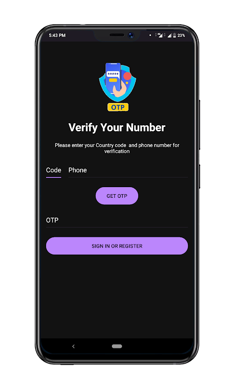
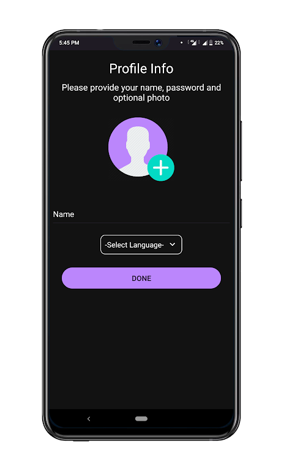
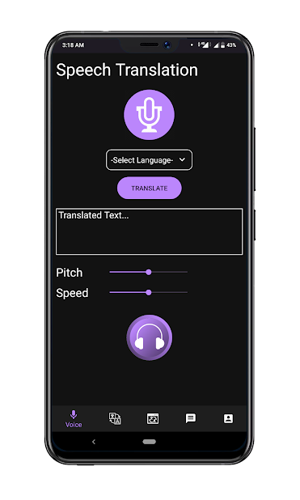
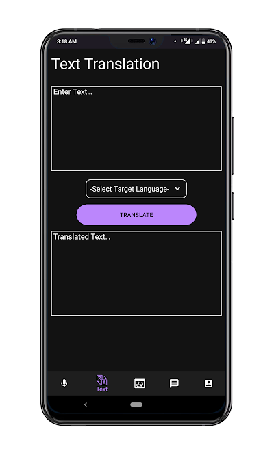
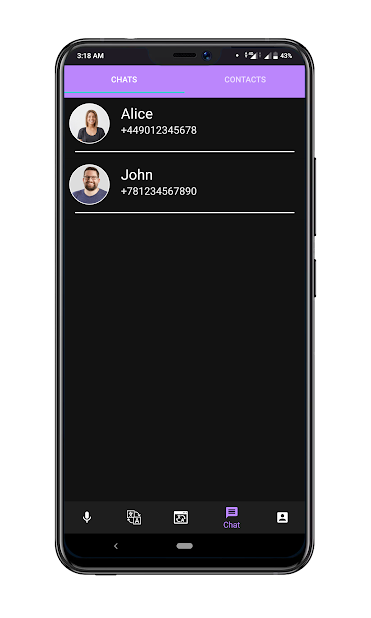
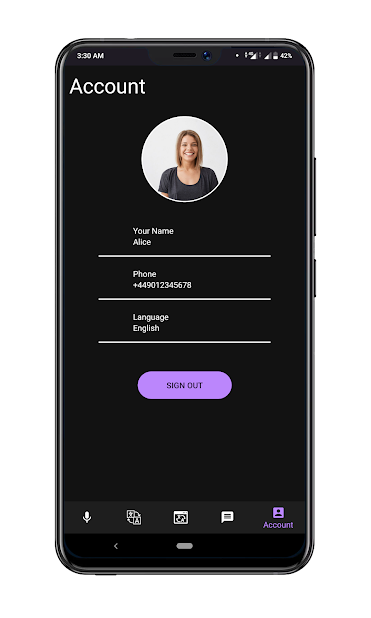

## Chatter Box: Messaging, Voice, Text, Image Translation App
Chatter Box is an android app that is capable of Voice, Text, Image Text Translation along with a Chatting feature with the in-Built translator that converts the message to another person default language which is set up during the sign-in process. It supports 9 languages.

## Overview

The app consists of 5 main tasks:
* Sign-in: In this, the User sign-in the app user phone number and verifies it with OTP. They also provide their name and optional profile photo.
* Speech Translation: It converts your speech to other languages and outputs its translation in the form of speech along with the translated text.
* Text Translation: It converts your Text to other languages and outputs its translation in the form of Text.
* Image Text translation: It recognizes the text in the image then translates the text into a targeted language.
* Chatting: In this, Users can communicate with other people with their phone numbers. In this the message is translated into other user default languages.

## Features  

* Supports translation between any pair of 9 languages
* Supports functionality like Speech-to-speech Translation with speed and pitch settings
* It is very secure as it Sign-in or Register with phone number with OTP verification
* Easy to use
* Help people to understand and learn different language

## API Used
* Yandex Translate Web API : https://translate.yandex.com/
* OCR API: [https://ocr.space/ocrapi](https://ocr.space/ocrapi)
* Google

## Screenshot

## Improvements to be added
* Responsive Layout
* Minor Bugs

## Note
All the API used are free of cost(may not be as accurate as paid API)

Feature request and bug reports are welcome.
